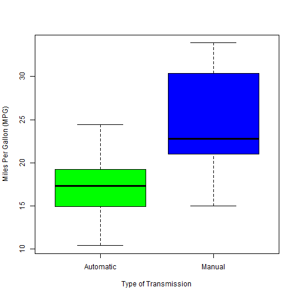
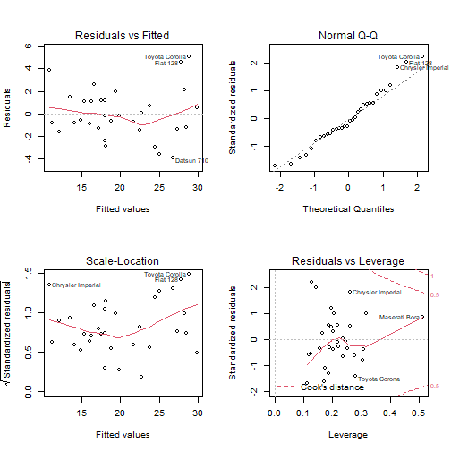

---
output:
  pdf_document: default
  html_document: default
---

# Regression Models Course Project - Motor Trend Project

RB,   
08.02.2021


```r
library(datasets)
library(ggplot2)
```

# Introduction
In this analysis, exploring the mtcars data set we will answer the following questions using amongst other things linear regression and multivariable linear regression:

**1. Is an automatic or manual transmission better for miles per gallone (MPG)?**

**2. What is the MPG difference between automatic and manual transmissions?**  


## Exploratory Analysis

```r
data(mtcars)
head(mtcars)
```

```
##                    mpg cyl disp  hp drat    wt  qsec vs am gear carb
## Mazda RX4         21.0   6  160 110 3.90 2.620 16.46  0  1    4    4
## Mazda RX4 Wag     21.0   6  160 110 3.90 2.875 17.02  0  1    4    4
## Datsun 710        22.8   4  108  93 3.85 2.320 18.61  1  1    4    1
## Hornet 4 Drive    21.4   6  258 110 3.08 3.215 19.44  1  0    3    1
## Hornet Sportabout 18.7   8  360 175 3.15 3.440 17.02  0  0    3    2
## Valiant           18.1   6  225 105 2.76 3.460 20.22  1  0    3    1
```

Transform variables am, cyl, vs, am, gear, carb, into factor variable with discrete values:


```r
mtcars$cyl <- factor(mtcars$cyl)
mtcars$vs <- factor(mtcars$vs)
mtcars$gear <- factor(mtcars$gear)
mtcars$carb <- factor(mtcars$carb)
mtcars$am <- factor(mtcars$am,labels=c('Automatic','Manual'))
str(mtcars)
```

```
## 'data.frame':	32 obs. of  11 variables:
##  $ mpg : num  21 21 22.8 21.4 18.7 18.1 14.3 24.4 22.8 19.2 ...
##  $ cyl : Factor w/ 3 levels "4","6","8": 2 2 1 2 3 2 3 1 1 2 ...
##  $ disp: num  160 160 108 258 360 ...
##  $ hp  : num  110 110 93 110 175 105 245 62 95 123 ...
##  $ drat: num  3.9 3.9 3.85 3.08 3.15 2.76 3.21 3.69 3.92 3.92 ...
##  $ wt  : num  2.62 2.88 2.32 3.21 3.44 ...
##  $ qsec: num  16.5 17 18.6 19.4 17 ...
##  $ vs  : Factor w/ 2 levels "0","1": 1 1 2 2 1 2 1 2 2 2 ...
##  $ am  : Factor w/ 2 levels "Automatic","Manual": 2 2 2 1 1 1 1 1 1 1 ...
##  $ gear: Factor w/ 3 levels "3","4","5": 2 2 2 1 1 1 1 2 2 2 ...
##  $ carb: Factor w/ 6 levels "1","2","3","4",..: 4 4 1 1 2 1 4 2 2 4 ...
```

We calculate and plot (Fig. 1) the averaged miles per gallon for manual and automatic transmission each

```r
aggregate(mpg~am, data = mtcars, mean)
```

```
##          am      mpg
## 1 Automatic 17.14737
## 2    Manual 24.39231
```


```r
boxplot(mpg ~ am, data = mtcars, col = (c("green","blue")), ylab = "Miles Per Gallon (MPG)", xlab = "Type of Transmission")
```



## Statistical Testing 
Based on our explorative data analysis we will now test if the calculated MPG difference of **7.15** between manual and automatic is significant. 
To test our hypothesis we use a two-sided-unpaired Welch t-test assuming unequal variance with significance level 0.05.


```r
automatic <- mtcars[mtcars$am == "Automatic",]
manual <- mtcars[mtcars$am == "Manual",]
t.test(automatic$mpg, manual$mpg, conf.level = 0.95, 
       alternative="two.sided", var.equal = FALSE, paired = FALSE)
```

```
## 
## 	Welch Two Sample t-test
## 
## data:  automatic$mpg and manual$mpg
## t = -3.7671, df = 18.332, p-value = 0.001374
## alternative hypothesis: true difference in means is not equal to 0
## 95 percent confidence interval:
##  -11.280194  -3.209684
## sample estimates:
## mean of x mean of y 
##  17.14737  24.39231
```

A p-value of **0.0013** was obtained and the confidence interval of the test does not contain zero. We conclude that we reject the null hypothesis. 
This means that there is significant difference between the
the transmission types manual and automatic.


## Regression Analysis - Linear Models

First we start with a simple linear regression model by taking "am" as the only regressor to predict mpg:

```r
model_base <- lm(mpg ~ am, data = mtcars)
summary(model_base)
```

```
## 
## Call:
## lm(formula = mpg ~ am, data = mtcars)
## 
## Residuals:
##     Min      1Q  Median      3Q     Max 
## -9.3923 -3.0923 -0.2974  3.2439  9.5077 
## 
## Coefficients:
##             Estimate Std. Error t value Pr(>|t|)    
## (Intercept)   17.147      1.125  15.247 1.13e-15 ***
## amManual       7.245      1.764   4.106 0.000285 ***
## ---
## Signif. codes:  0 '***' 0.001 '**' 0.01 '*' 0.05 '.' 0.1 ' ' 1
## 
## Residual standard error: 4.902 on 30 degrees of freedom
## Multiple R-squared:  0.3598,	Adjusted R-squared:  0.3385 
## F-statistic: 16.86 on 1 and 30 DF,  p-value: 0.000285
```

A adjusted R-squared value of is obtained which means that this simple linear model explains only **34%** of the variability.

So the next step is to use adjusted multivariable linear regression model including **cyl**, **disp**, **hp** and **wt** as counfounding variables.


```r
model_adjust <- lm(mpg ~ am + cyl + disp + hp + wt, data = mtcars)
summary(model_adjust)
```

```
## 
## Call:
## lm(formula = mpg ~ am + cyl + disp + hp + wt, data = mtcars)
## 
## Residuals:
##     Min      1Q  Median      3Q     Max 
## -3.9374 -1.3347 -0.3903  1.1910  5.0757 
## 
## Coefficients:
##              Estimate Std. Error t value Pr(>|t|)    
## (Intercept) 33.864276   2.695416  12.564 2.67e-12 ***
## amManual     1.806099   1.421079   1.271   0.2155    
## cyl6        -3.136067   1.469090  -2.135   0.0428 *  
## cyl8        -2.717781   2.898149  -0.938   0.3573    
## disp         0.004088   0.012767   0.320   0.7515    
## hp          -0.032480   0.013983  -2.323   0.0286 *  
## wt          -2.738695   1.175978  -2.329   0.0282 *  
## ---
## Signif. codes:  0 '***' 0.001 '**' 0.01 '*' 0.05 '.' 0.1 ' ' 1
## 
## Residual standard error: 2.453 on 25 degrees of freedom
## Multiple R-squared:  0.8664,	Adjusted R-squared:  0.8344 
## F-statistic: 27.03 on 6 and 25 DF,  p-value: 8.861e-10
```
 
Now a adjusted R-squared value of **83%** is obtained which is much higher than for the simple model. Lets see what the ANOVA-analysis shows.


```r
anova(model_base, model_adjust)
```

```
## Analysis of Variance Table
## 
## Model 1: mpg ~ am
## Model 2: mpg ~ am + cyl + disp + hp + wt
##   Res.Df    RSS Df Sum of Sq      F    Pr(>F)    
## 1     30 720.90                                  
## 2     25 150.41  5    570.49 18.965 8.637e-08 ***
## ---
## Signif. codes:  0 '***' 0.001 '**' 0.01 '*' 0.05 '.' 0.1 ' ' 1
```
We obtain a very significant p-value of **8.6e-8**, hence we conclude that the adjusted model predicts the mpg significantly better than the simple model.

## Residuals and Diagnostics


```r
par(mfrow = c(2, 2))
plot(model_adjust)
```



Residuals vs. Fitted plot show that the points are randomly distributed on the plot verifying the independence condition.
In the normal Q-Q plot the points fall mostly on the line indicating that the residuals are normally distributed.

## Conclusion

The analyis indicates that cars with manual transmission achieve a higher MPG (**+ 7.15**) compared to automatic cars (Fig. 1). 
However when confounding variables like number of cylinders, displacement, gross horsepower and weight are taken into account the difference between manual and automatic transmission (**1.8**, adjusted by cyl, disp, hp, and wt) is not as clear as the explorative analyis was suggesting in the beginning. 
